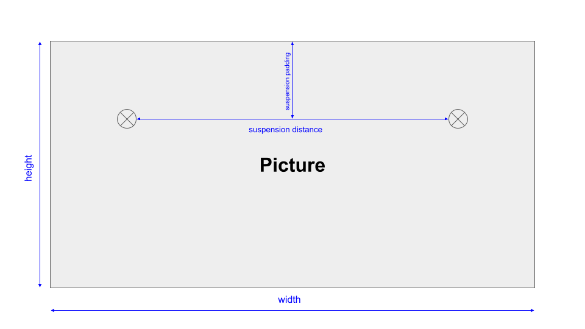
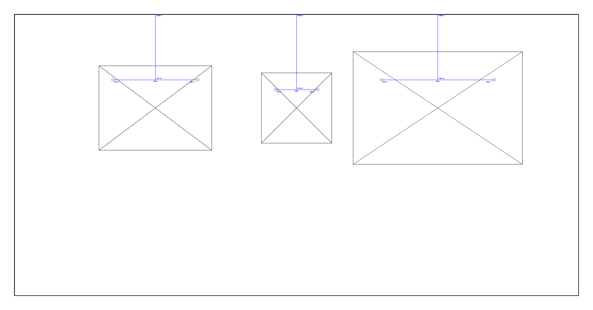
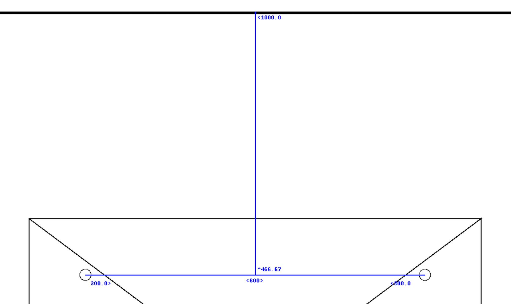

# wallc

Calculate the layout on the wall to hang up pictures.

## Installation

```python
pip install XXX
```

## Getting Started

Currently a picture has 4 different parameters:



Use the `wallc` module to initialize the wall and all planned pictures with certain parameters:

```python
from wallc import Picture, Suspension, Wall, Layout

p1 = Picture(800, 600, Suspension(600, 100))
p2 = Picture(500, 500, Suspension(300, 120))
p3 = Picture(1200, 800, Suspension(800, 200))
layout = Layout(Wall(4000, 2000), pictures=[p1, p2, p3])
layout.layout()
layout.draw()
```



There are different marks in the output image to specify the exact positions to hang on the pictures on the wall:


